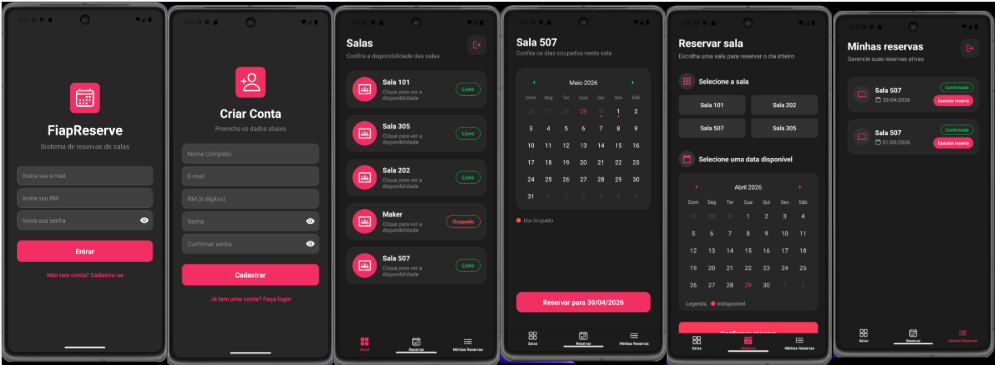

# **FiapReserve**

## **a) Sobre o Projeto**

**Nome do app:** FiapReserve

**Descrição do problema que resolve:** A dificuldade e a perda de tempo na busca por espaços de estudo e laboratórios disponíveis no edifício. O aplicativo centraliza a visualização e a reserva de salas, evitando conflitos de horários e a frustração de encontrar uma sala ocupada.

**Qual operação da FIAP foi escolhida e por quê:** Escolhemos a **Gestão de Infraestrutura e Recursos Acadêmicos** (especificamente, a reserva de salas e laboratórios). Escolhemos essa operação porque, como alunos, sabemos da alta demanda por espaços específicos (como Salas Maker e Laboratórios) para o desenvolvimento de CPs, projetos e trabalhos em grupo. Otimizar esse processo melhora diretamente a experiência do aluno e facilita o controle por parte da faculdade.

**Funcionalidades implementadas:**
* **Interface de Login:** Tela inicial de autenticação do usuário via RM ou Email institucional.
* **Listagem de Salas em Tempo Real:** Tela de visualização rápida do status das salas (Livre / Ocupado).
* **Sistema de Reserva (Context API):** Tela dedicada para reservar salas disponíveis. A ação utiliza o gerenciamento de estado global (Context API) para atualizar instantaneamente a disponibilidade da sala escolhida em todas as abas do aplicativo, sem necessidade de recarregar a tela.
* **Navegação por Abas:** Roteamento estruturado utilizando `expo-router` (Tabs Navigation).

---

## **b) Nome dos integrantes**

* Isabelle Dias Belini
* Júlia Souza Marques
* Manoella dos Santos Ginez

---

## **c) Como Rodar o Projeto**

Siga as instruções abaixo para configurar o ambiente e rodar o projeto *FiapReserve* em sua máquina

**1. Pré-requisitos:**

Antes de começar, certifique-se de ter instalado:
* **Node.js**: Versão 18 ou superior (LTS recomendada).
* **Gerenciador de Pacotes**: npm (instalado com o Node) ou Yarn.
* **Expo Go**: Aplicativo instalado no seu celular ([Android](https://play.google.com/store/apps/details?id=host.exp.exponent) ou [iOS](https://apps.apple.com/br/app/expo-go/id982107779)).
* **Git**: Para clonar o repositório.
 
**2. Passo a Passo para Execução**

* **Clonar o repositório:**
Abra o seu terminal (ou o terminal do VS Code) e execute:
git clone [https://github.com/jumarques03/fiap-cpad-cp1-FiapReserve.git](https://github.com/jumarques03/fiap-cpad-cp1-FiapReserve.git)
* **Instalar dependências:** npm install --legacy-peer-deps
* **Iniciar o projeto:** npx expo start
* **Abrir o app:** celular > escaneie o QR Code no terminal usando o app Expo Go / emulador > pressione a para Android ou i para iOS (Mac)

---

## **d) Demonstração**

**Telas do app:**

#### **Demonstração do fluxo principal do app:**
[Clique aqui para assistir a demonstração](https://drive.google.com/file/d/1gFa9835UYajSBvto9NdALXPUk3EeqhEH/view?usp=sharing)

---

## **e) Decisões Técnicas**

### **Breve descrição de como o projeto foi estruturado:**
O aplicativo foi estruturado utilizando o Expo Router com organização modular baseada em grupos de rotas, permitindo uma divisão clara entre autenticação e funcionalidades principais. As telas de Login e Cadastro foram organizadas dentro da pasta `(auth)`, responsável pelo fluxo de autenticação de usuários. Já as funcionalidades centrais do sistema, como Salas, Reservar e Minhas Reservas, foram estruturadas dentro da pasta `(tabs)`, utilizando navegação por abas para oferecer uma experiência mais intuitiva e organizada ao usuário autenticado.  

A estrutura principal do projeto foi organizada da seguinte forma:
- `app/`: responsável pelas rotas, telas e layouts da aplicação.
- `app/(auth)/`: telas de autenticação (Login e Cadastro).
- `app/(tabs)/`: telas principais após autenticação.
- `context/`: gerenciamento global de estados e persistência de dados com Context API e AsyncStorage.
- `assets/`: recursos visuais, como imagens e ícones.  

No diretório `context`, foram centralizadas todas as principais regras de negócio da aplicação:
- `AuthContext.js`: autenticação e sessão
- `ReservasContext.js`: gerenciamento de reservas
- `SalasContext.js`: gerenciamento das salas disponíveis   

Toda a estilização foi desenvolvida com StyleSheet do React Native, garantindo padronização visual e organização.

### Quais Contexts foram criados e o que cada um gerencia:

- #### AuthContext:
    Responsável pelo gerenciamento global de autenticação dos usuários, incluindo:
    - Cadastro de usuários
    - Login
    - Logout
    - Persistência de sessão com AsyncStorage
    - Verificação de autenticação para navegação protegida  

- #### ReservasContext:
    Responsável pelo gerenciamento global das reservas realizadas, incluindo:
    - Criação de reservas
    - Cancelamento de reservas
    - Persistência das reservas no AsyncStorage
    - Sincronização de dados entre diferentes telas  

- #### SalasContext:
    Responsável pelo gerenciamento das salas disponíveis no sistema, incluindo:
    - Lista de salas
    - Status de disponibilidade
    - Atualização visual conforme reservas realizadas

### Como a autenticação foi implementada:
A autenticação foi implementada utilizando Context API integrada ao AsyncStorage. Durante o cadastro, os dados dos usuários (nome, e-mail, RM e senha) são validados e armazenados localmente.  

No login:
- O sistema valida se o usuário existe
- Verifica se as credenciais estão corretas
- Salva a sessão do usuário autenticado
- Atualiza o estado global
- Redireciona automaticamente para a área principal  

Ao reiniciar o aplicativo:
- A sessão persistida é carregada automaticamente
- Usuários autenticados permanecem logados  

Também foi implementado o logout, removendo a sessão ativa e retornando o usuário ao fluxo de autenticação.

### Como o AsyncStorage foi utilizado (quais dados são persistidos e com quais chaves):
O AsyncStorage foi utilizado para persistência local dos dados essenciais do aplicativo, garantindo funcionamento contínuo mesmo após o fechamento do app.

#### Chaves utilizadas:
- `usuarios`: armazena todos os usuários cadastrados
- `sessao`: armazena o usuário atualmente autenticado
- `reservas`: armazena todas as reservas realizadas

#### Dados persistidos incluem:
- Dados cadastrais dos usuários
- Sessão de login
- Reservas realizadas
- Disponibilidade das salas com base nas reservas  

Essa implementação garante:
- Sessão persistente
- Reservas salvas localmente
- Atualização contínua das informações

### Quais hooks foram usados e para quê:

- **useRouter**: Utilizado para navegação programática entre telas, redirecionamento após autenticação e controle de fluxo.

- **useContext**: Utilizado para compartilhamento global de autenticação, reservas e informações das salas.

- **useState**: Utilizado para gerenciamento de estados locais, como inputs, formulários, erros e seleções.

- **useEffect**:
    Utilizado para:
    - Carregar usuários cadastrados
    - Recuperar sessão persistida
    - Carregar reservas
    - Inicializar dados ao abrir o aplicativo

### Como a navegação protegida foi implementada:
A navegação foi organizada com separação entre rotas públicas e protegidas:

- `(auth)`: Login e Cadastro
- `(tabs)`: Salas, Reservar e Minhas Reservas

No arquivo `_layout.js` principal:
- O sistema verifica se existe uma sessão ativa
- Caso exista, o usuário é direcionado automaticamente para `(tabs)`
- Caso contrário, é redirecionado para `(auth)/login`

Essa abordagem garante proteção de rotas e impede o acesso às funcionalidades principais sem autenticação válida, simulando um sistema real de controle de acesso.

---

## **f) Diferencial Implementado**

### **Qual diferencial foi escolhido:** 
O diferencial técnico implementado no projeto foi a utilização da **Animated API** do React Native para aprimoramento da experiência visual e interação do usuário durante processos críticos, como autenticação e cadastro.

**Justificativa:**  
O grupo escolheu esse diferencial com o objetivo de tornar a experiência de uso mais intuitiva, dinâmica e visualmente responsiva. A aplicação de animações fornece feedback imediato ao usuário durante ações importantes, melhorando significativamente a usabilidade da aplicação.  

No login e cadastro, quando ocorre erro de validação ou falha nas credenciais, o botão principal executa uma animação de “shake” (chacoalhar horizontalmente), indicando visualmente que houve um problema nas informações inseridas. Já em situações de sucesso, como o cadastro concluído corretamente, foi implementado um pop-up animado deslizante, reforçando positivamente a ação realizada.  

**Como foi implementado (resumo técnico):**  
A implementação foi realizada utilizando os recursos nativos da **Animated API** do React Native, com uso de:

- `Animated.Value`: criação dos valores animáveis
- `Animated.sequence`: execução de múltiplas animações em sequência para o efeito de shake
- `Animated.timing`: controle de transições suaves com duração configurável
- `useRef`: persistência dos valores animados entre renderizações
- `transform: translateX`: movimentação horizontal para feedback de erro
- `transform: translateY`: animação vertical para exibição e ocultação do alerta de sucesso

No fluxo de login:
- Caso as credenciais estejam incorretas ou os campos inválidos, o botão de login executa a animação de erro.

No fluxo de cadastro:
- Caso haja erro de validação, o botão executa a animação de erro.
- Caso o cadastro seja concluído com sucesso, um alerta animado é exibido temporariamente na parte superior da tela, seguido do redirecionamento automático para a tela de login.

Essa abordagem permitiu melhorar a comunicação visual do sistema sem depender de bibliotecas externas, mantendo o projeto leve, organizado e tecnicamente consistente.
